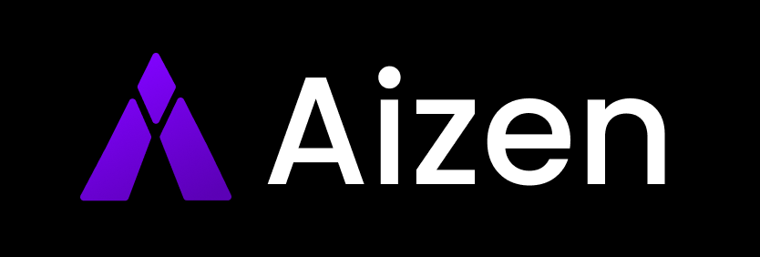

<p align="center">
  
</p>

<p align="center">
  <strong>A real-time AI assistant that thinks, searches, and answers.</strong>
</p>

<p align="center">
  AIZEN is a real-time AI assistant that searches the web, verifies facts with live data, and delivers accurate, context-aware answers — powered by LLMs and intelligent tool calling.
</p>

<p align="center">
  
  
  
  
  <!--  -->
</p>

## 🌟 Features

- **Real-time Web Search** — Grounds every answer with live search results via Tavily (or DuckDuckGo as fallback).
- **Tool Calling** — LangGraph ReAct agent decides when and what to search automatically.
- **Fast LLM Inference** — Groq-hosted models for low-latency responses.
- **Conversational UI** — Clean chat interface with responses, sources, and error handling.

## 📷 Screenshots

<p>
  <a href="https://plane.so" target="_blank">
    
  </a>
</p>

<p>
  <a href="https://plane.so" target="_blank">
    
  </a>
</p>

## 🛠️ Tech Stack


## ✅ Requirements

| Setup | What You Need |
| ----- | ------------- |
| Without Docker | Python 3.12+, Node.js 20+, npm |
| With Docker | [Docker](https://docs.docker.com/get-docker/) + Docker Compose |

## 🔐 Environment Variables

### Backend — `backend/.env`
| Variable | Description | Default |
|----------|-------------|---------|
| `GROQ_API_KEY` | Your Groq API key — get it at [console.groq.com](https://console.groq.com) | required |
| `TAVILY_API_KEY` | Your Tavily API key — get it at [tavily.com](https://tavily.com/) sign up and create a key in the dashboard | required |
| `GROQ_MODEL_NAME` | Groq-hosted Llama model to use | `qwen/qwen3-32b` |
| `TEMPERATURE` | AI creativity level (0.0 = strict, 1.0 = creative) | `0.1` |

### Frontend — `frontend/.env`

| Variable | Description | Default |
|----------|-------------|---------|
| `VITE_API_URL` | Backend API base URL | `http://127.0.0.1:8000` |


> Copy `env.example` from each folder and rename to `.env` before running.


## 🚀 Installation


### Option 1 — Docker (Recommended)

**1. Clone the repo**
```bash
git clone https://github.com/Mananpatel08/aizen.git
cd aizen
```


**2. Add env files**
```bash
cp backend/env.example backend/.env
cp frontend/env.example frontend/.env
```
Fill in your values — see [Environment Variables](#-environment-variables) above.

**3. Start containers**
```bash
docker compose up --build
```


### Option 2 — Manual Setup

**1. Clone the repo**
```bash
git clone https://github.com/Mananpatel08/aizen.git
cd aizen
```


**2. Backend**
```bash
python -m venv .venv
source .venv/bin/activate        # Windows: .venv\Scripts\activate
cd backend
pip install -r requirements.txt
cp env.example .env              # fill in your values
uvicorn app.main:app --reload --host 0.0.0.0 --port 8000
```

**4. Frontend** *(new terminal)*
```bash
cd frontend
npm install
cp env.example .env              # fill in your values
npm run dev
```

Open → http://localhost:5173

## 🚧 Features Implementation

- 💾 **Persistent Chat History** — Store and revisit past conversations across sessions.
- 🧠 **Cross-Chat Memory** — Use previous chat context so AIZEN remembers what you've discussed before.